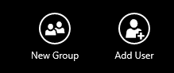

<h2>How to add Groups of users to your applications</h2>
As an **account owner** of an application, you can configure groups of users and account owners for your application.

**To create a group**

1. Open the application from the list of applications on the main screen
 
1. Click on the **Manage Team** button in the application bar to open up the **Users and groups** page  
    

1. Click on the **New Group** button in the app bar  
    